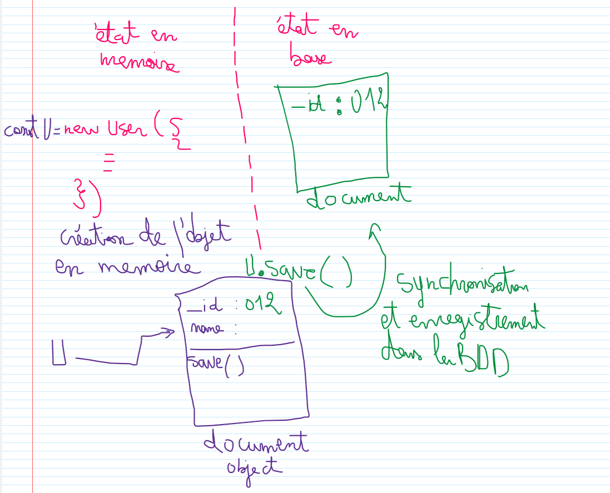
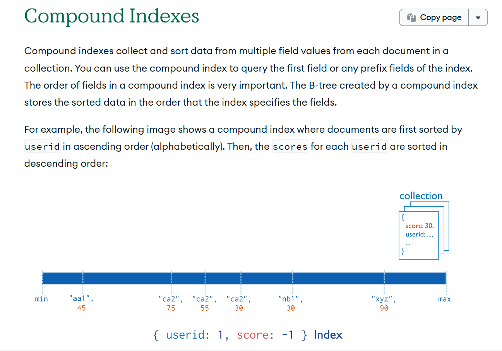
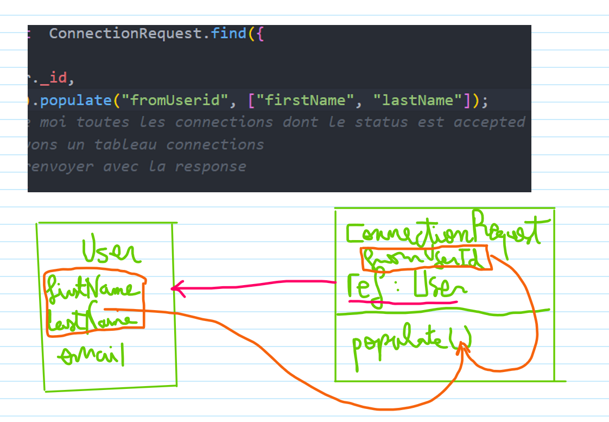

#FIND DEVS APIS

##AUTH ROUTER
- POST /signup
- POST /login
- POST /logout

##profile ROUTER 
- GET /profile/view
- PATCH /profile/edit
- PATCH /profile/password  //forgot password api

##Connection Router
-POST /sendConnectionRequest/interested/:userId
-POST /sendConnectionRequest/ignore/:userId
-POST /receiveConnectionRequest/accepted/:userId
-POST /receiveConnectionRequest/rejected/:userId

#Connection request Router
POST /request/send/:status/:userId

STATUS of connectionRequest: ignored, interested, accepted, rejected

##user connection ROUTER
GET /connections
GET /requests/received
GET /feed 
//gives you the profiles of all the users 

Plus il y a d'index, plus les lectures sont rapides, mais plus les écritures sont coûteuses.

